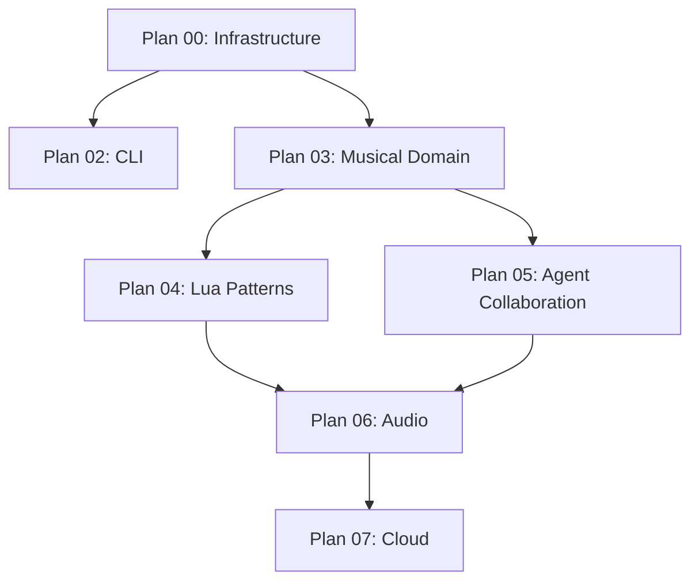

# HalfRemembered MCP Implementation Plans

## Overview

These plans guide the implementation of HalfRemembered MCP, progressing from basic infrastructure to a musical collaboration system where agents can jam together.

## Plan Sequence

### Phase 1: Foundation
- **[Plan 00: Event Duality Hello World](00-event-duality-hello/)** 🎵 NEW & Pure
  - Proves intentions become sounds
  - Minimal MCP server with WebSocket
  - The simplest truth

- **[Plan 02: CLI Client](02-cli/)** ⏳ Ready after Plan 00
  - Command-line interface for testing
  - Beautiful, stateless CLI
  - Unix-friendly piping support

### Phase 2: Musical Core 🎵
- **[Plan 03: Musical Domain Model](03-musical-domain/)** 🆕 **Critical**
  - Event Duality (Concrete/Abstract)
  - Conversation Tree with forking
  - Musical Context system
  - Agent communication protocol

### Phase 3: Advanced Features
- **[Plan 04: Musical Pattern Scripting](04-lua/)**
  - Lua-based pattern generators
  - Musical transformations
  - Hot-reloadable patterns
  - Integration with conversation tree

- **[Plan 05: Agent Collaboration](05-agent-collaboration/)** 🆕
  - Agent capability registry
  - Request queue system
  - Task delegation
  - Multi-agent workflows

### Phase 4: Future Expansions
- **Plan 06: Real-Time Audio** (Not yet defined)
  - CLAP plugin architecture
  - MIDI 2.0 support
  - Audio synthesis

- **Plan 07: Cloud Integration** (Not yet defined)
  - External model connections
  - Distributed jamming
  - Cloud agent federation

## Execution Order

## Key Concepts

Our plans incorporate these ideas from the domain model research:

1. **Conversation Trees**: Git-like branching for musical exploration
2. **Event Duality**: Both concrete data and abstract intentions
3. **Agent Request Queues**: True collaboration, not turn-taking
4. **Musical Context**: Shared knowledge that guides generation
5. **Temporal Forking**: Explore multiple musical futures simultaneously

## Success Metrics

We'll know we've succeeded when:
- ✅ Two agents can fork and explore ideas in parallel
- ✅ Musical context influences all generation
- ✅ Agents can delegate to specialists
- ✅ Conversations can be saved and resumed
- ✅ The system feels like jamming with musicians, not using a tool

## Current Status

- **Completed**: Domain model research, plan structure
- **In Progress**: Plan 03 (Musical Domain Model)
- **Next Up**: Implement Plan 03, then Plan 05
- **Future**: Audio synthesis, cloud integration

## Development Philosophy

From our research and plans:
- **Conversation over Commands**: Music emerges from dialogue
- **Exploration over Perfection**: Fork to try ideas, merge what works
- **Collaboration over Control**: Agents have specialties and autonomy
- **Musical over Technical**: Domain concepts drive the architecture

---

**Last Updated**: 2025-11-15
**Contributors**:
- Amy Tobey
- 🤖 Claude <claude@anthropic.com>
- 💎 Gemini <gemini@google.com>