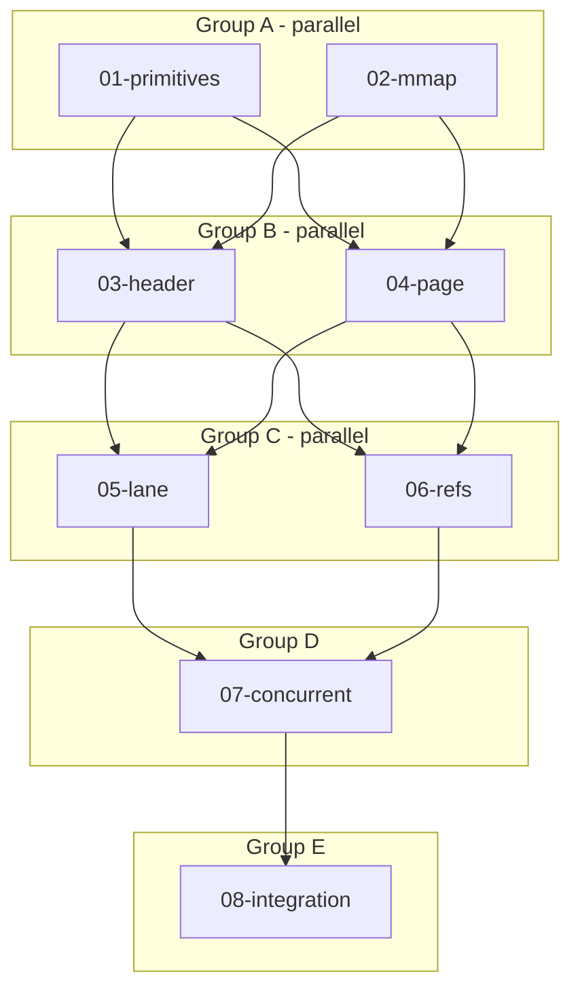

# Canvas Crate

**Location:** `crates/canvas`
**Status:** Design Complete

The canvas is an mmap'd temporal storage for audio, MIDI, and event streams. It's the "living score" - async by design, for past and future content, not real-time "now". Multiple processes can share a canvas via mmap.

**What canvas IS:** Storage layer. Pages, lanes, refs, metadata.
**What canvas is NOT:** Playback, RT, buses, effect processing.

Playheads/attention are a separate concern that *uses* canvas. Chaosgarden handles RT output.

---

## Core Concepts

**Canvas** - An mmap'd file containing pages of audio/event data
**Page** - A fixed-duration time bucket (30s default) containing lanes
**Lane** - A single stream within a page (audio, MIDI, metadata, etc.)
**CanvasRef** - A reference to content elsewhere (for linking, not copying)

```
Canvas (mmap'd file, sparse)
├── Header (Cap'n Proto) - config, page index
├── Page 0 [00:00 - 00:30]
│   ├── Lane 0: Audio (f32 stereo)
│   ├── Lane 1: Audio (f32 stereo)
│   ├── Lane 2: MIDI events
│   └── Lane 3: Latent params (unrealized)
├── Page 1 [00:30 - 01:00]
│   └── ...
└── Page N [sparse - not yet allocated]
```

---

## Progress Tracking

| Task | Status | Parallel Group | Notes |
|------|--------|----------------|-------|
| 01-primitives | pending | A | Types, constants, Cap'n Proto schema |
| 02-mmap | pending | A | mmap helpers, sparse file handling |
| 03-header | pending | B | Canvas header, page index |
| 04-page | pending | B | Page structure, lane allocation |
| 05-lane | pending | C | Lane read/write, type handling |
| 06-refs | pending | C | CanvasRef system |
| 07-concurrent | pending | D | Multi-reader/writer safety |
| 08-integration | pending | E | Full API, ergonomic wrappers |

Note: Playheads/attention are NOT part of this crate. They're a separate concern.

## Execution Flow



---

## Success Metrics

- [ ] All unit tests pass
- [ ] Concurrent access tests pass under stress
- [ ] Sparse file behavior verified (unwritten pages don't consume disk)
- [ ] 45-minute canvas with 16 lanes fits in reasonable memory
- [ ] RT read path has no syscalls or allocations

---

## Key Design Decisions

### Sparse mmap
Unwritten pages don't consume disk space. We use `fallocate(FALLOC_FL_PUNCH_HOLE)` or equivalent to keep sparse files sparse.

### Cap'n Proto for metadata
Headers and metadata use Cap'n Proto for zero-copy reads and forward compatibility.

### f32 PCM for audio
No compression overhead. ~11MB/min stereo @ 48kHz. We have RAM.

### Per-playhead realization
Each playhead can realize latent content differently based on context. No global caching of realizations - that can come later as optimization.

### Fixed page size
30 seconds, 1MB per page. Simplifies mmap layout. Can tune later.

---

## Documents

| Document | Focus | Read When |
|----------|-------|-----------|
| [DETAIL.md](./DETAIL.md) | Design rationale | Revision sessions |
| [TESTS.md](./TESTS.md) | Test strategy | Writing tests |
| [01-primitives.md](./01-primitives.md) | Core types | Implementing types |
| [02-mmap.md](./02-mmap.md) | mmap helpers | Implementing mmap |
| [03-header.md](./03-header.md) | Canvas header | Implementing header |
| [04-page.md](./04-page.md) | Page structure | Implementing pages |
| [05-lane.md](./05-lane.md) | Lane operations | Implementing lanes |
| [06-refs.md](./06-refs.md) | Reference system | Implementing refs |
| [07-concurrent.md](./07-concurrent.md) | Concurrency | Implementing safety |
| [08-integration.md](./08-integration.md) | Full API | Final integration |

---

## Consumers of Canvas

Canvas is a storage library. These components will use it:

| Component | Uses Canvas For |
|-----------|-----------------|
| **Hootenanny** | Orchestration writes (Orpheus → canvas), attention/playhead logic |
| **Chaosgarden** | Reads pre-rendered audio via ring buffers (not direct canvas access) |
| **Attention module** | Playhead state, realization triggers (may be in hootenanny or separate) |
| **CLI tools** | Inspection, export, debugging |

Note: Chaosgarden likely won't link canvas directly. Hootenanny reads canvas, feeds chaosgarden via ring buffers.

---

## Test Strategy

See [TESTS.md](./TESTS.md) for comprehensive test plan.

---

## Open Questions

- [ ] Exact page size tuning (30s/1MB is starting point)
- [ ] Lane limit per page (16? 32? 64?)
- [ ] Cross-lane references for effects (sidechain, etc.)
