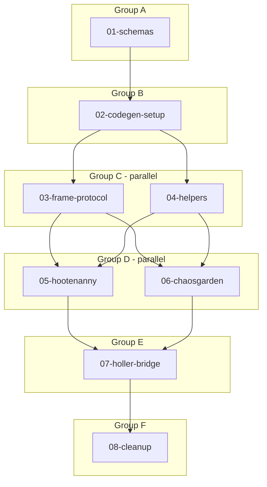

# Cap'n Proto Migration

**Location:** `crates/hooteproto`
**Status:** Design Complete

Replace MsgPack serialization with Cap'n Proto for zero-copy message handling across the Hootenanny message bus. Enables polyglot access (Rust, Python, Lua) via shared schemas.

---

## Progress Tracking

| Task | Status | Group | Notes |
|------|--------|-------|-------|
| 01-schemas | ✅ complete | A | All .capnp schema definitions |
| 02-codegen-setup | ✅ complete | B | build.rs, crate structure |
| 03-frame-protocol | ✅ complete | C | HootFrame ContentType update |
| 04-helpers | ✅ complete | C | domain.rs with JobId/JobInfo/JobStatus helpers |
| 05-hootenanny | pending | D | Migrate message handling |
| 06-chaosgarden | pending | D | Migrate RT message handling |
| 07-holler-bridge | pending | E | JSON↔capnp at MCP edge |
| 08-cleanup | pending | F | Remove msgpack, verify |

## Success Metrics

- [x] All schemas compile with `capnpc`
- [x] `cargo test -p hooteproto` passes
- [ ] `cargo test -p hootenanny` passes
- [ ] `cargo test -p chaosgarden` passes
- [ ] MCP tools work end-to-end through holler
- [ ] No `rmp-serde` dependency remains
- [ ] Python can load schemas with `pycapnp`

## Execution Flow



## Agent Dispatch

### Group A (1 agent)
```
Agent 1: "Read 01-schemas.md and implement all Cap'n Proto schemas."
```

### Group B (1 agent, after A)
```
Agent 1: "Read 02-codegen-setup.md and set up code generation."
```

### Group C (2 agents, parallel, after B)
```
Agent 1: "Read 03-frame-protocol.md and update HootFrame."
Agent 2: "Read 04-helpers.md and implement helper wrappers."
```

### Group D (2 agents, parallel, after C)
```
Agent 1: "Read 05-hootenanny.md and migrate hootenanny."
Agent 2: "Read 06-chaosgarden.md and migrate chaosgarden."
```

### Group E (1 agent, after D)
```
Agent 1: "Read 07-holler-bridge.md and implement JSON translation."
```

### Group F (1 agent, after E)
```
Agent 1: "Read 08-cleanup.md and finalize migration."
```

### Output Format
When complete, report:
- Files modified (paths)
- Tests added/passing
- Blockers or follow-up discovered
- Key context the orchestrator should know

## Architecture Overview

```
Claude ←JSON→ Holler ←Cap'n Proto→ Hootenanny ←Cap'n Proto→ Chaosgarden
                │                       │
                │                       └──Cap'n Proto──→ Luanette
                │
            Translation layer
            (JSON ↔ capnp)
```

**Wire format:** HootFrame with `ContentType::CapnProto`

**Schema organization:**
```
crates/hooteproto/schemas/
├── common.capnp      # Timestamp, errors, identifiers
├── envelope.capnp    # Message envelope, routing
├── tools.capnp       # All tool requests/responses
├── garden.capnp      # Timeline, transport, RT events
├── broadcast.capnp   # PUB/SUB events
└── jobs.capnp        # Job system types
```

## Documents

| Document | Focus | Read When |
|----------|-------|-----------|
| [DETAIL.md](./DETAIL.md) | Design rationale, alternatives | Revision sessions |
| [01-schemas.md](./01-schemas.md) | Cap'n Proto schema definitions | Writing schemas |
| [02-codegen-setup.md](./02-codegen-setup.md) | build.rs, crate setup | Setting up codegen |
| [03-frame-protocol.md](./03-frame-protocol.md) | HootFrame changes | Updating frame handling |
| [04-helpers.md](./04-helpers.md) | Ergonomic Rust API | Writing helpers |
| [05-hootenanny.md](./05-hootenanny.md) | Hootenanny migration | Migrating hootenanny |
| [06-chaosgarden.md](./06-chaosgarden.md) | Chaosgarden migration | Migrating chaosgarden |
| [07-holler-bridge.md](./07-holler-bridge.md) | JSON↔capnp translation | MCP boundary |
| [08-cleanup.md](./08-cleanup.md) | Remove msgpack, verify | Final cleanup |

## Key Decisions

- **All-in migration** — No hybrid MsgPack/capnp, clean transition
- **No backwards compat** — Delete old code, rewrite entirely
- **Schema as source of truth** — Types derive from .capnp, not Rust structs
- **Translation at edge only** — JSON↔capnp happens in holler, nowhere else
- **Zero-copy for hot path** — Chaosgarden reads directly from ZMQ buffers
- **garden.rs replaced** — The Jupyter-style IPC types in garden.rs get replaced by garden.capnp

## Scope Clarification

**In scope:**
- hooteproto, hootenanny, chaosgarden, holler

**Out of scope (for now):**
- Luanette — uses same ZMQ protocol but can be migrated in follow-up
- audio-graph-mcp — separate concern

## Resolved Questions

- **capnp version:** Use `capnp = "0.19"` (stable, well-documented)
- **Schema IDs:** Generate random with `capnp id`, one per file
- **Helper style:** Thin wrappers, not full abstraction — callers can use raw capnp when needed
- **Domain types:** Keep `JobStatus`, `JobId` etc. in hooteproto as Rust enums/newtypes. These are domain types independent of wire format. Helpers convert capnp ↔ domain types.
