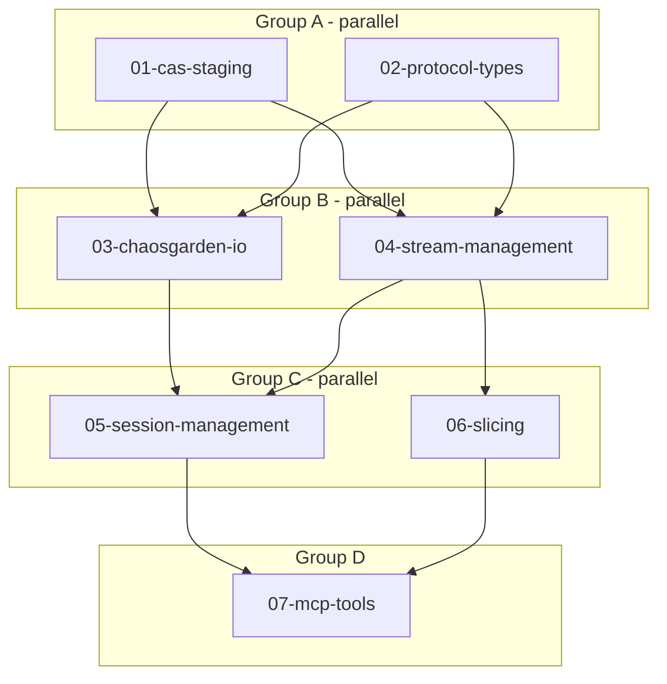

# Capture Sessions

**Status:** Design Complete
**Crates:** `crates/cas`, `crates/chaosgarden`, `crates/hootenanny`

Record audio/MIDI streams from hardware into artifacts with seamless slicing.

---

## Architecture Summary

```
hootenanny (control)                   chaosgarden (RT)
      │                                      │
      │── StreamStart{uri, path_0} ─────────▶│ mmap, write samples
      │◀── StreamHeadPosition ───────────────│ (Broadcast)
      │◀── StreamChunkFull{path_0} ──────────│
      │  seal(path_0), create path_1         │
      │── StreamSwitchChunk{path_1} ────────▶│ close, mmap new
      │                                      │
```

- **CAS** owns staging layout (`staging/` + `content/`, seal = rename or copy)
- **Hootenanny** manages file lifecycle, manifests, sessions, slicing
- **Chaosgarden** only does I/O: open → mmap → write → notify → close

---

## Progress

| Task | Status | Group | Crate |
|------|--------|-------|-------|
| 01-cas-staging | **done** | A | cas |
| 02-protocol-types | **done** | A | hooteproto |
| 03-chaosgarden-io | pending | B | chaosgarden |
| 04-stream-management | pending | B | hootenanny |
| 05-session-management | pending | C | hootenanny |
| 06-slicing | pending | C | hootenanny |
| 07-mcp-tools | pending | D | hootenanny |

---

## Execution Flow



---

## Agent Dispatch

### Group A (2 agents, parallel)
```
Agent 1: "Read 01-cas-staging.md and implement. No other tasks."
Agent 2: "Read 02-protocol-types.md and implement. No other tasks."
```

### Group B (2 agents, parallel, after A complete)
```
Agent 1: "Read 03-chaosgarden-io.md and implement."
Agent 2: "Read 04-stream-management.md and implement."
```

### Group C (2 agents, parallel, after B complete)
```
Agent 1: "Read 05-session-management.md and implement."
Agent 2: "Read 06-slicing.md and implement."
```

### Group D (1 agent, after C complete)
```
Agent 1: "Read 07-mcp-tools.md and implement."
```

### Output Format
When complete, report:
- Files modified (paths)
- Tests added/passing
- Blockers or follow-up discovered

---

## Success Metrics

- [ ] `cargo test -p cas` passes with staging tests
- [ ] `cargo test -p hooteproto` passes with message types
- [ ] `cargo test -p chaosgarden` passes with stream I/O tests
- [ ] `cargo test -p hootenanny` passes with stream/session tests
- [ ] End-to-end: start stream → write samples → seal chunk → slice → artifact created
- [ ] No new warnings (`cargo clippy`)

---

## Key Types (Quick Reference)

```capnp
# New schema: schemas/streams.capnp

# Commands (add to envelope.capnp Payload union)
struct StreamStart { uri, definition, chunkPath }
struct StreamSwitchChunk { uri, newChunkPath }
struct StreamStop { uri }

# Events (add to broadcast.capnp Broadcast union)
struct StreamHeadPosition { streamUri, samplePosition, bytePosition, wallClock }
struct StreamChunkFull { streamUri, path, bytesWritten, samplesWritten, wallClock }
struct StreamError { streamUri, error, recoverable }
```

```rust
// Rust domain types (crates/hootenanny)
struct StreamUri(String);           // "stream://eurorack-audio/main"
enum CasAddress { Content(Blake3Hash), Staging(Blake3Hash) }
struct StreamManifest { stream_uri, chunks: Vec<ChunkRef>, .. }
struct CaptureSession { id, streams, segments, timeline, status }
```

Full types in [DETAIL.md](./DETAIL.md#type-definitions).

---

## Documents

| Doc | Purpose | When to Read |
|-----|---------|--------------|
| [DETAIL.md](./DETAIL.md) | Design rationale, full types, boundary spec | Deep context, revisions |
| 01-cas-staging.md | CAS staging implementation | Implementing task 01 |
| 02-protocol-types.md | ZMQ messages, stream types | Implementing task 02 |
| 03-chaosgarden-io.md | RT stream I/O | Implementing task 03 |
| 04-stream-management.md | Hootenanny stream lifecycle | Implementing task 04 |
| 05-session-management.md | Session/segment handling | Implementing task 05 |
| 06-slicing.md | Slice API implementation | Implementing task 06 |
| 07-mcp-tools.md | MCP tool exposure | Implementing task 07 |

---

## Open Questions

| Question | Status |
|----------|--------|
| Chunk size tuning (128K samples) | Experiment after basic impl |
| mmap flags for RT | Experiment |
| Device disconnect handling | Design during impl |
