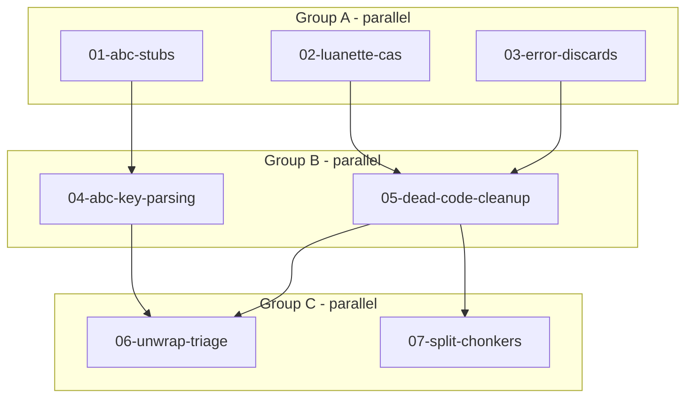

# Tech Debt Cleanup

**Location:** `docs/agents/plans/tech-debt/`
**Status:** In Progress

---

## Progress Tracking

| Task | Status | Parallel Group | Notes |
|------|--------|----------------|-------|
| 01-abc-stubs | ✅ done | A | Implemented transpose, to_abc, semitones_to_key |
| 02-luanette-cas | ✅ done | A | CAS fetch/execute + 5 new tests |
| 03-error-discards | ✅ done | A | Fixed 20 `let _ =` patterns |
| 04-abc-key-parsing | ✅ done | B | Highland bagpipe + explicit accidentals, 9 new tests |
| 05-dead-code-cleanup | ✅ done | B | Deleted ~65 lines, 8 annotations removed |
| 06-unwrap-triage | pending | C | Final polish |
| 07-split-chonkers | pending | C | Refactor large files |

## Success Metrics

- [ ] `cargo test` passes in all crates
- [ ] `rg 'todo!\(' crates/` returns 0 results
- [ ] `rg 'let _ =' crates/` returns only intentional discards
- [ ] All `#[allow(dead_code)]` removed or have justifying comment
- [ ] No source file over 800 lines (except tests)

---

## Execution Flow



---

## Documents

| Document | Focus | Read When |
|----------|-------|-----------|
| [01-abc-stubs.md](./01-abc-stubs.md) | Implement transpose, to_abc, semitones_to_key | Implementing abc stubs |
| [02-luanette-cas.md](./02-luanette-cas.md) | CAS script fetching | Implementing luanette CAS |
| [03-error-discards.md](./03-error-discards.md) | Fix `let _ =` patterns | Fixing error discards |
| [04-abc-key-parsing.md](./04-abc-key-parsing.md) | Explicit accidentals | Completing key parser |
| [05-dead-code-cleanup.md](./05-dead-code-cleanup.md) | Remove/justify dead code | Cleaning dead code |
| [06-unwrap-triage.md](./06-unwrap-triage.md) | Add error context | Triaging unwraps |
| [07-split-chonkers.md](./07-split-chonkers.md) | Split large files | Splitting files |

---

## Agent Dispatch

### Group A (3 agents, parallel)
```
Agent 1: "Read docs/agents/plans/tech-debt/01-abc-stubs.md and implement."
Agent 2: "Read docs/agents/plans/tech-debt/02-luanette-cas.md and implement."
Agent 3: "Read docs/agents/plans/tech-debt/03-error-discards.md and implement."
```

### Group B (2 agents, after A)
```
Agent 1: "Read docs/agents/plans/tech-debt/04-abc-key-parsing.md and implement."
Agent 2: "Read docs/agents/plans/tech-debt/05-dead-code-cleanup.md and implement."
```

### Group C (2 agents, after B)
```
Agent 1: "Read docs/agents/plans/tech-debt/06-unwrap-triage.md and implement."
Agent 2: "Read docs/agents/plans/tech-debt/07-split-chonkers.md and implement."
```

### Output Format
When complete, report:
- Files modified (paths)
- Tests added/passing
- Blockers or follow-up discovered
- Key context the orchestrator should know

**Ask early, ask often.** When you hit ambiguity, ask — your questions go directly to the user, and their answers stay in your context. A 30-second question beats a 30-minute wrong implementation.

---

## Open Questions

- [ ] Should we add a CI check for `let _ =` patterns?
- [ ] What's the tolerance for unwrap in test code?

---

## Definition of Done (all tasks)

```bash
cargo fmt --check
cargo clippy -- -D warnings
cargo check
cargo test
```
