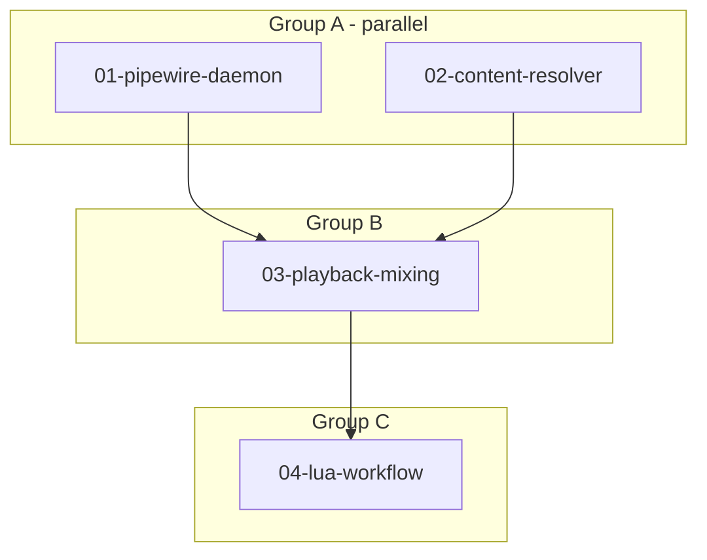

# The Road to Live Orpheus Loop

**Location:** `crates/chaosgarden`, `crates/hootenanny`, `crates/luanette`
**Status:** Design Complete

**Goal:** Generate MIDI with Orpheus, render to WAV, play through chaosgarden with 2 concurrent tracks (drums + melody) via PipeWire.

---

## Progress Tracking

| Task | Status | Group | Notes |
|------|--------|-------|-------|
| 01-pipewire-daemon | pending | A | Wire PipeWire output to daemon |
| 02-content-resolver | pending | A | Artifact → decoded audio samples |
| 03-playback-mixing | pending | B | Mix concurrent regions to output |
| 04-lua-workflow | pending | C | Luanette orchestration script |

## Success Metrics

- [ ] Single WAV artifact plays through PipeWire
- [ ] Two concurrent regions mix and play
- [ ] Lua script generates + plays drums & melody loop
- [ ] Zero underruns during playback

## Execution Flow



## Agent Dispatch

### Group A (2 agents, parallel)
```
Agent 1: "Read 01-pipewire-daemon.md and implement."
Agent 2: "Read 02-content-resolver.md and implement."
```

### Group B (1 agent)
```
Agent 1: "Read 03-playback-mixing.md and implement."
```

### Group C (1 agent)
```
Agent 1: "Read 04-lua-workflow.md and implement."
```

### Output Format
When complete, report:
- Files modified (paths)
- Tests added/passing
- Blockers or follow-up discovered
- Key context the orchestrator should know

## Architecture Overview

```
┌─────────────────────────────────────────────────────────────┐
│                        MCP Tools                             │
│  orpheus_generate → convert_midi_to_wav → garden_create_region │
└─────────────────────────────────────────────────────────────┘
                              │
                              ▼
┌─────────────────────────────────────────────────────────────┐
│                     Chaosgarden Daemon                       │
│  ┌──────────┐    ┌─────────────────┐    ┌────────────────┐  │
│  │ Timeline │───▶│ PlaybackEngine  │───▶│ PipeWireOutput │  │
│  │ Regions  │    │ (mix N regions) │    │ (RT callback)  │  │
│  └──────────┘    └─────────────────┘    └────────────────┘  │
│       │                   ▲                                  │
│       ▼                   │                                  │
│  ┌──────────┐    ┌─────────────────┐                        │
│  │ Behavior │───▶│ ContentResolver │                        │
│  │PlayContent│   │ (CAS → samples) │                        │
│  └──────────┘    └─────────────────┘                        │
└─────────────────────────────────────────────────────────────┘
```

## Documents

| Document | Focus | Read When |
|----------|-------|-----------|
| [01-pipewire-daemon.md](./01-pipewire-daemon.md) | Connect PipeWire to daemon | Wiring audio output |
| [02-content-resolver.md](./02-content-resolver.md) | Load WAV from artifacts | Content loading |
| [03-playback-mixing.md](./03-playback-mixing.md) | Mix multiple regions | Multi-track support |
| [04-lua-workflow.md](./04-lua-workflow.md) | Orchestration script | End-to-end workflow |

## Key Existing Code

| File | Contains |
|------|----------|
| `chaosgarden/src/pipewire_output.rs` | PipeWireOutputStream, StreamStats |
| `chaosgarden/src/playback.rs` | PlaybackEngine, render logic |
| `chaosgarden/src/daemon.rs` | GardenDaemon, ZMQ handling |
| `chaosgarden/src/nodes.rs` | AudioFileNode, decode_wav |
| `hootenanny/src/api/tools/garden.rs` | MCP garden_* tools |

## Design Decisions (see DETAIL.md)

- **Pre-decode on region create** — fail fast, simpler implementation
- **Simple summing for mixing** — no per-track gain/pan for v1
- **Configurable sample rate** — default 48kHz, all content must match session rate for v1

## Open Questions

- [ ] Loop point handling: explicit loop regions or auto-loop timeline?
- [ ] What if MIDI tempo doesn't match timeline tempo?
- [ ] Automatic resampling when content rate != session rate? (rubato crate)
