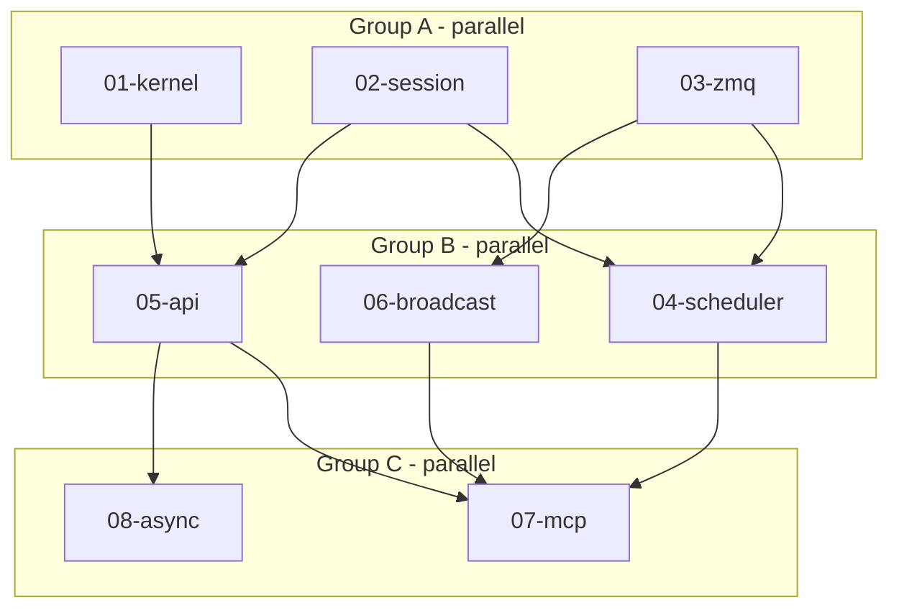

# Vibeweaver

**Location:** `crates/vibeweaver`
**Status:** Design Complete

---

## Overview

Rust process with embedded Python (PyO3). Subscribes to ZMQ broadcasts, maintains session state in sqlite, exposes a Python DSL for AI agents making music.

```
┌─────────────┐      ZMQ       ┌─────────────┐      ZMQ      ┌─────────────┐
│ chaosgarden │◄──────────────►│ hootenanny  │◄─────────────►│ vibeweaver  │
│  (RT audio) │                │  (router)   │               │ (Rust+PyO3) │
└─────────────┘                └─────────────┘               └─────────────┘
                                     ▲                             │
                                     │ holler MCP             embedded
                                     ▼                             ▼
                               ┌─────────────┐               ┌───────────┐
                               │   Claude    │               │  Python   │
                               │   et al.    │               │  kernel   │
                               └─────────────┘               └───────────┘
```

---

## Progress Tracking

| Task | Status | Group | Notes |
|------|--------|-------|-------|
| 01-kernel | pending | A | PyO3 interpreter, persistent globals |
| 02-session | pending | A | Session + sqlite persistence |
| 03-zmq | pending | A | DEALER + SUB sockets |
| 04-scheduler | pending | B | Rule index, trigger matching, priority queue |
| 05-api | pending | B | Python API (sample, schedule, latent) |
| 06-broadcast | pending | B | Broadcast → state updates |
| 07-mcp | pending | C | weave_eval, weave_session, weave_reset, weave_help |
| 08-async | pending | C | pyo3-async-runtimes integration |

## Success Metrics

- [ ] `weave_eval` executes Python with persistent state
- [ ] Broadcasts update kernel state between evals
- [ ] Rules persist and restore across restart
- [ ] All tests pass

## Execution Flow



## Agent Dispatch

### Group A (3 agents, parallel)
```
Agent 1: "Read 01-kernel.md and implement."
Agent 2: "Read 02-session.md and implement."
Agent 3: "Read 03-zmq.md and implement."
```

### Output Format
When complete, report:
- Files modified
- Tests passing
- Blockers discovered

## Documents

| Document | Focus |
|----------|-------|
| [DETAIL.md](./DETAIL.md) | Design rationale, types, sqlite schema |
| 01-kernel.md | PyO3 interpreter |
| 02-session.md | Session + sqlite |
| 03-zmq.md | ZMQ client |
| 04-scheduler.md | Rule matching, priority queue |
| 05-api.md | Python API surface |
| 06-broadcast.md | Broadcast handling |
| 07-mcp.md | MCP tools |
| 08-async.md | Async patterns |

## Key Decisions

- **Jupyter**: No — build our own UI later
- **Concurrent sessions**: Process-level (run multiple vibeweavers)
- **Import sandbox**: No restrictions for MVP
- **Hot reload**: Yes
- **Async runtime**: `pyo3-async-runtimes`
- **Callbacks**: Become rules (data, not code) — persist to sqlite
- **Python globals**: NOT persisted (can't pickle functions)
